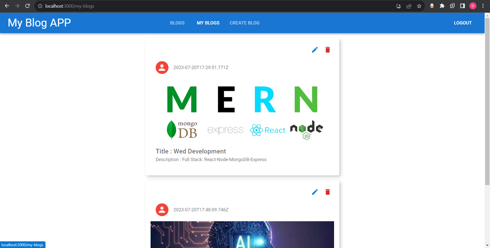

# Blog.it

  

A MERN stack Blog App , with user authentication.

 

## Getting Started

-   Fork this repo and run the `git clone <forked repo>` command from your terminal/bash
-   Cd into the directories and `npm install`
-   Create a `.env` file in the root directory and store the following:
    -   MONGO_URI=Insert the correct connection URL for your MongoDB database
-   Run the server on PORT 8080
-   npm start

You can obtain the MONGO_URI after create a collectoin on [mongodb atlas](https://www.mongodb.com/cloud/atlas). 

## Demo

The app has been hosted on heroku [here](https://mern-blog-it.herokuapp.com/). P.S: You might have to wait for a few seconds for the heroku site to respond.

 

## Info

-   This is a blogging user authentication and authorization.The blog posts are displayed in the reverse chronological order by default.

 
 

## Technologies Used

Some of the technologies used in the development of this web application are as follow:

-   [MongoDB Atlas](https://www.mongodb.com/cloud/atlas): It provides a free cloud service to store MongoDB collections.
-   [React.js](https://reactjs.org/): A JavaScript library for building user interfaces.
-   [Node.js](https://nodejs.org/en/): A runtime environment to help build fast server applications using JS.
-   [Express.js](https://expressjs.com/): A popular Node.js framework to build scalable server-side for web applications.
-   [Mongoose](https://mongoosejs.com/): An ODM(Object Data Modelling)library for MongoDB and Node.js

It can be noted that React can be swapped out in favor of any other popular frontend framework like Vue, Angular, Svelte or Ember
